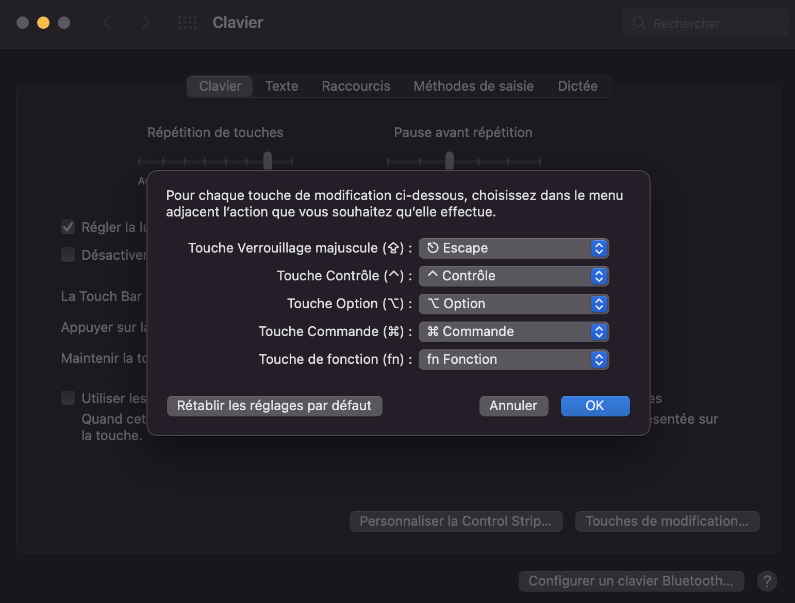

# Neovim-config


## 1. Install plugins manager
Use of [packer](https://github.com/wbthomason/packer.nvim) plugin management.

Installation:
```
git clone --depth 1 https://github.com/wbthomason/packer.nvim\
 ~/.local/share/nvim/site/pack/packer/start/packer.nvim
```


Create a ~/.config/nvim folder (if you don't have one already) and copy init.lua and the folder lua.

Once is done, open nvim and install pluginsby typing

```
:PackerSync
```

Finally, restart nvim and check if everything is corectly installed

### 1.1 Autocomplete plugin
We are using LSP mode for autocompletion. One needs to install specific language support.

To do this, in nvim type:
```
:LspInstallInfo
```
select the language support you want and install it by typing 'i'.

### 2.1 Code formatting plugin
We are using null-ls plugin. This may need to install additionnal code formater, have a look [here](https://github.com/jose-elias-alvarez/null-ls.nvim/blob/main/doc/BUILTINS.md) .

### 2.2 Telescope
Telescope needs ripgrep to find pattern in files. 

Installation in Ubuntu:
```
sudo apt-get install ripgrep
```
Installation on Macos

```
brew install ripgrep
```


## 3. Switch Caplocks button to ESC

### 3.1 On Ubuntu
Type in the terminal:
```
sudo apt install gnome-tweaks
```
Launch it via:
```
gnome-tweaks
```
* go to “Keyboard & Mouse” tab, and click on “Additional Layout Options”
* Inside “Caps Lock Behavior” choose “Make Caps Lock an additional Esc”
* Open VS Code settings via File -> Preferences -> Settings. And type “dispatch”
* Then, change from “code” to “keyCode”

### 3.2 On MACOs
* Got to Preference -> Keyboard -> "Modification keys" and select "Escape" in "Caplocks Key".



## 4. Vim shortkeys
Can be found [here](shortkeys.md)
